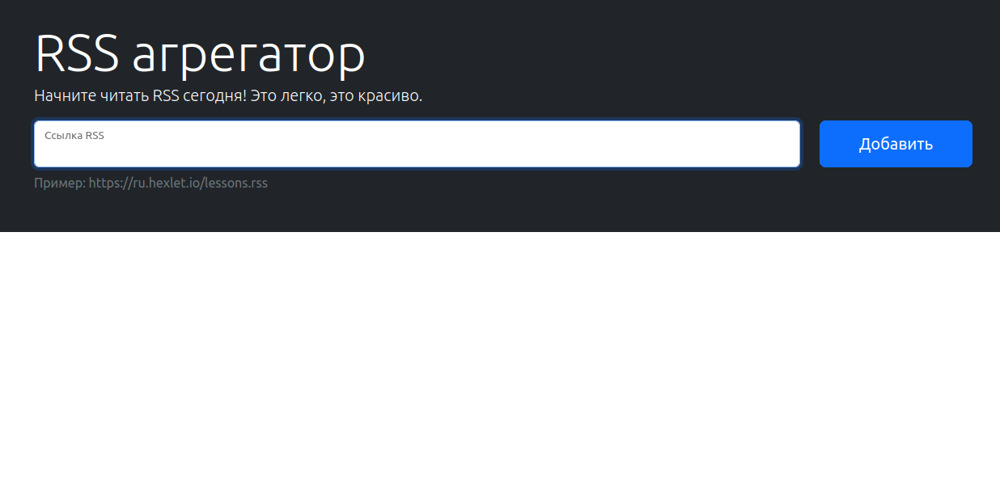

# RSS Agregator

----------------------------------------------------------------------------------------------------

Этот проект реализует сервис, представляющий rss-поток в виде ссылок на посты с возможностью просмотра их описания и проверяющий его на наличие новых постов.

----------------------------------------------------------------------------------------------------
